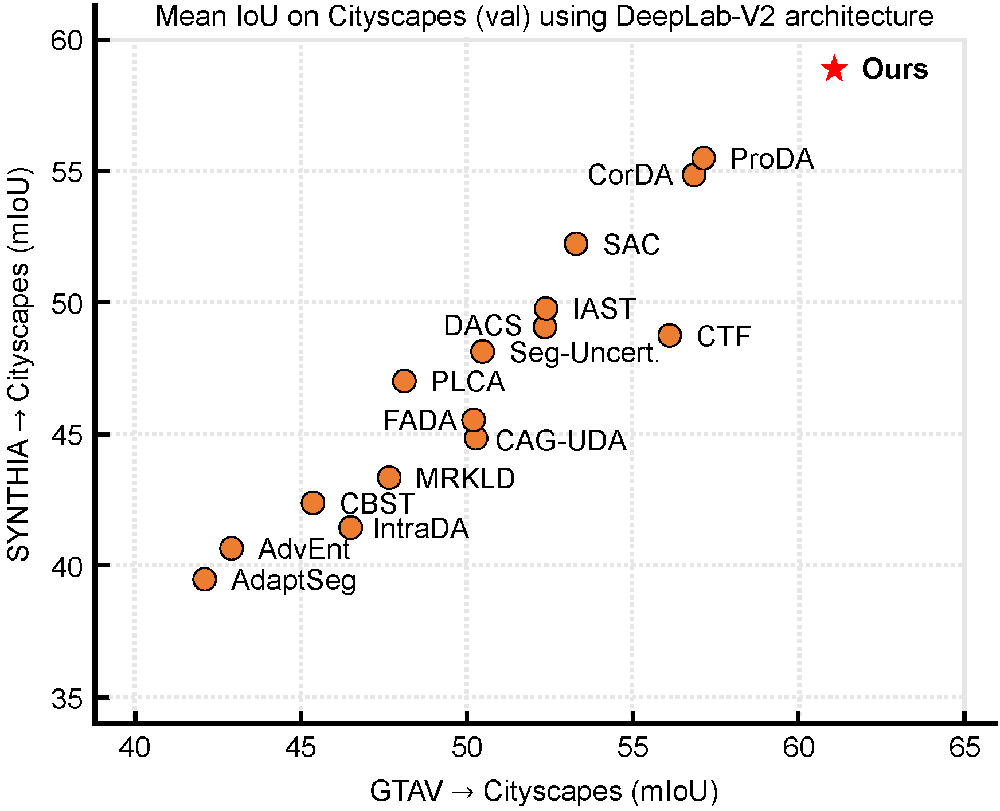

---

<div align="center">    
 
# SePiCo: Semantic-Guided Pixel Contrast for Domain Adaptive Semantic Segmentation (TPAMI 2023)

[Binhui Xie](https://binhuixie.github.io), [Shuang Li](https://shuangli.xyz), [Mingjia Li](https://kiwixr.github.io), [Chi Harold Liu](https://scholar.google.com/citations?user=3IgFTEkAAAAJ&hl=en), [Gao Huang](http://www.gaohuang.net), and [Guoren Wang](https://scholar.google.com.hk/citations?hl=en&user=UjlGD7AAAAAJ)


[](https://arxiv.org/abs/2204.08808)&nbsp;&nbsp;
[](https://binhuixie.github.io/sepico-web/)&nbsp;&nbsp;


</div>

**Update on 2023/02/15: Code release for Cityscapes &rarr; Dark Zurich.**

**Update on 2023/01/14: 🥳 We are happy to announce that SePiCo has been accepted in an upcoming issue of the TPAMI.**

**Update on 2022/09/24: All checkpoints are available.**

**Update on 2022/09/04: Code release.**

**Update on 2022/04/20: ArXiv Version of [SePiCo](https://arxiv.org/abs/2204.08808) is available.**

[//]: # ([![PWC]&#40;https://img.shields.io/endpoint.svg?url=https://paperswithcode.com/badge/sepico-semantic-guided-pixel-contrast-for/semantic-segmentation-on-dark-zurich&#41;]&#40;https://paperswithcode.com/sota/semantic-segmentation-on-dark-zurich?p=sepico-semantic-guided-pixel-contrast-for&#41;)

[//]: # ()
[//]: # ([![PWC]&#40;https://img.shields.io/endpoint.svg?url=https://paperswithcode.com/badge/sepico-semantic-guided-pixel-contrast-for/unsupervised-domain-adaptation-on-synthia-to&#41;]&#40;https://paperswithcode.com/sota/unsupervised-domain-adaptation-on-synthia-to?p=sepico-semantic-guided-pixel-contrast-for&#41;)

[//]: # ()
[//]: # ([![PWC]&#40;https://img.shields.io/endpoint.svg?url=https://paperswithcode.com/badge/sepico-semantic-guided-pixel-contrast-for/synthetic-to-real-translation-on-gtav-to&#41;]&#40;https://paperswithcode.com/sota/synthetic-to-real-translation-on-gtav-to?p=sepico-semantic-guided-pixel-contrast-for&#41;)

[//]: # ()
[//]: # ([![PWC]&#40;https://img.shields.io/endpoint.svg?url=https://paperswithcode.com/badge/sepico-semantic-guided-pixel-contrast-for/synthetic-to-real-translation-on-synthia-to-1&#41;]&#40;https://paperswithcode.com/sota/synthetic-to-real-translation-on-synthia-to-1?p=sepico-semantic-guided-pixel-contrast-for&#41;)


<!-- TOC -->

- [Overview](#overview)
- [Installation](#installation)
- [Datasets Preparation](#datasets-preparation)
  - [Download Datasets](#download-datasets)
  - [Setup Datasets](#setup-datasets)
- [Model Zoo](#model-zoo)
- [SePiCo Evaluation](#sepico-evaluation)
- [SePiCo Training](#sepico-training)
- [Tips on Code Understanding](#tips-on-code-understanding)
- [Acknowledgments](#acknowledgments)
- [Citation](#citation)
- [Contact](#contact)

<!-- /TOC -->

## Overview

In this work, we propose Semantic-Guided Pixel Contrast (SePiCo), a novel one-stage adaptation framework that highlights the semantic concepts of individual pixel to promote learning of class-discriminative and class-balanced pixel embedding space across domains, eventually boosting the performance of self-training methods.




<div align="right">
<b><a href="#overview">↥</a></b>
</div>

## Installation

This code is implemented with `Python 3.8.5` and `PyTorch 1.7.1` on `CUDA 11.0`.

To try out this project, it is recommended to set up a virtual environment first:

```bash
# create and activate the environment
conda create --name sepico -y python=3.8.5
conda activate sepico

# install the right pip and dependencies for the fresh python
conda install -y ipython pip
```

Then, the dependencies can be installed by:

```bash
# install required packages
pip install -r requirements.txt

# install mmcv-full, this command compiles mmcv locally and may take some time
pip install mmcv-full==1.3.7  # requires other packeges to be installed first
```

**Alternatively**, the `mmcv-full` package can be installed faster with official pre-built packages, for instance:

```bash
# another way to install mmcv-full, faster
pip install mmcv-full==1.3.7 -f https://download.openmmlab.com/mmcv/dist/cu110/torch1.7.0/index.html
```

The environment is now fully prepared.

<div align="right">
<b><a href="#overview">↥</a></b>
</div>

## Datasets Preparation

### Download Datasets

- **GTAV:** Download all zipped images, along with their zipped labels, from [here](https://download.visinf.tu-darmstadt.de/data/from_games/) and extract them to a custom directory.
- **Cityscapes:** Download leftImg8bit_trainvaltest.zip and gtFine_trainvaltest.zip from [here](https://www.cityscapes-dataset.com/downloads/) and extract them to a custom directory.
- **Dark Zurich:** Download Dark_Zurich_train_anon.zip, Dark_Zurich_val_anon.zip and Dark_Zurich_test_anon_withoutGt.zip from [here](https://www.trace.ethz.ch/publications/2019/GCMA_UIoU/) and extract them to a custom directory.

### Setup Datasets

Symlink the required datasets:

```bash
ln -s /path/to/gta5/dataset data/gta
ln -s /path/to/cityscapes/dataset data/cityscapes
ln -s /path/to/dark_zurich/dataset data/dark_zurich
```

Perform preprocessing to convert label IDs to the train IDs and gather dataset statistics:

```bash
python tools/convert_datasets/gta.py data/gta --nproc 8
python tools/convert_datasets/cityscapes.py data/cityscapes --nproc 8
```

Ultimately, the data structure should look like this:

```shell
SePiCo
├── ...
├── data
│   ├── cityscapes
│   │   ├── gtFine
│   │   ├── leftImg8bit
│   ├── dark_zurich
│   │   ├── corresp
│   │   ├── gt
│   │   ├── rgb_anon
│   ├── gta
│   │   ├── images
│   │   ├── labels
├── ...
```

<div align="right">
<b><a href="#overview">↥</a></b>
</div>

## Model Zoo

We provide pretrained models of both Domain Adaptive Semantic Segmentation tasks through [Google Drive](https://drive.google.com/drive/folders/1dEkm3W79Wxoul6mqkpJP-ib1pKN0Mskm?usp=sharing) and [Baidu Netdisk](https://pan.baidu.com/s/1jlEH_PvTtlQEHNN0k0Yf8A) (access code: `pico`).

### GTAV &rarr; Cityscapes (DeepLab-v2 based)

| variants | model name                       | mIoU  | checkpoint download                    |
| :------- | :------------------------------- | :---: | :------------------------------------- |
| DistCL   | sepico_distcl_gta2city_dlv2.pth  | 61.0  | [Google](https://drive.google.com/drive/folders/1_MBcTv7eUtoUFOe5Yfct7u7tvh2hUBMs?usp=sharing) / [Baidu](https://pan.baidu.com/s/13ezZyF9ZkClpWI83CfvdpA) (acc: `pico`) |
| BankCL   | sepico_bankcl_gta2city_dlv2.pth  | 59.8  | [Google](https://drive.google.com/drive/folders/1j_o_yT-bCD7JawSdlZI-BmfrOREEFgSq?usp=sharing) / [Baidu](https://pan.baidu.com/s/1_QoPttSu0GuDUzHhZ7pfYQ) (acc: `pico`) |
| ProtoCL  | sepico_protocl_gta2city_dlv2.pth | 58.8  | [Google](https://drive.google.com/drive/folders/1YiIsvNa3Fp1coBQwQ-DeAZd8VFolbjt-?usp=sharing) / [Baidu](https://pan.baidu.com/s/1nc81QwJooA9_mxFxteVCJg) (acc: `pico`) |

### GTAV &rarr; Cityscapes (DAFormer based)

| variants | model name                           | mIoU  | checkpoint download                    |
| :------- | :----------------------------------- | :---: | :------------------------------------- |
| DistCL   | sepico_distcl_gta2city_daformer.pth  | 70.3  | [Google](https://drive.google.com/drive/folders/1svqqz2vdELZSbFh4x96OCx0i1tRQRqWn?usp=sharing) / [Baidu](https://pan.baidu.com/s/1OFOxN1kG0KqKej_5_48iVQ) (acc: `pico`) |
| BankCL   | sepico_bankcl_gta2city_daformer.pth  | 68.7  | [Google](https://drive.google.com/drive/folders/15FAcxpRilaYe4woShSYWfpQli8TZ57n6?usp=sharing) / [Baidu](https://pan.baidu.com/s/1JScQYfgSYL16wYGLesLYug) (acc: `pico`) |
| ProtoCL  | sepico_protocl_gta2city_daformer.pth | 68.5  | [Google](https://drive.google.com/drive/folders/1035n8ZtK94gMg1M9eGOnl0K9to2WRg3I?usp=sharing) / [Baidu](https://pan.baidu.com/s/1rFxRLHa-kqNDWXao0VPrfA) (acc: `pico`) |


### SYNTHIA &rarr; Cityscapes (DeepLab-v2 based)
| variants | model name                       | mIoU | checkpoint download                                                                                                                                                     |
| :------- |:---------------------------------|:----:|:------------------------------------------------------------------------------------------------------------------------------------------------------------------------|
| DistCL   | sepico_distcl_syn2city_dlv2.pth  | 58.1 | [Google](https://drive.google.com/drive/folders/1rYAwEc5EC9wdiGqdne_JqNKtVGzkv90C?usp=sharing) / [Baidu](https://pan.baidu.com/s/1hho5gxS3l63bicgUvS1GwA) (acc: `pico`) |
| BankCL   | sepico_bankcl_syn2city_dlv2.pth  | 57.4 | [Google](https://drive.google.com/drive/folders/1pkrX9HcB7F1VdaCvXyIshDhFeTb7Szs_?usp=sharing) / [Baidu](https://pan.baidu.com/s/1hho5gxS3l63bicgUvS1GwA) (acc: `pico`) |
| ProtoCL  | sepico_protocl_syn2city_dlv2.pth | 56.8 | [Google](https://drive.google.com/drive/folders/1keHACEdAT_w4MXCFSwptA91hAhDKwwK_?usp=sharing) / [Baidu](https://pan.baidu.com/s/1hho5gxS3l63bicgUvS1GwA) (acc: `pico`) |


### SYNTHIA &rarr; Cityscapes (DAFormer based)
| variants | model name                             | mIoU | checkpoint download                    |
| :------- |:---------------------------------------|:----:| :------------------------------------- |
| DistCL   | sepico_distcl_syn2city_daformer.pth    | 64.3 | [Google](https://drive.google.com/drive/folders/1BW4W5ehcuu8OWq8XlDFiZuyQImr_ibOe?usp=sharing) / [Baidu](https://pan.baidu.com/s/1g_ohhq84a__atnR2bg8I5w) (acc: `pico`) |
| BankCL   | sepico_bankcl_syn2city_daformer.pth    | 63.3 | [Google](https://drive.google.com/drive/folders/1uENM21Fx3BInwyO6_Qu5Iemh0QLYH5_e?usp=sharing) / [Baidu](https://pan.baidu.com/s/1g_ohhq84a__atnR2bg8I5w) (acc: `pico`) |
| ProtoCL  | sepico_protocl_syn2city_daformer.pth   | 62.9 | [Google](https://drive.google.com/drive/folders/1cxRnoDl8TtijWUmo1sXCUmHBHKbbKLfn?usp=sharing) / [Baidu](https://pan.baidu.com/s/1g_ohhq84a__atnR2bg8I5w) (acc: `pico`) |


### Cityscapes &rarr; Dark Zurich (DeepLab-v2 based)
| variants | model name                        | mIoU | checkpoint download                    |
| :------- |:----------------------------------|:----:| :------------------------------------- |
| DistCL   | sepico_distcl_city2dark_dlv2.pth  | 45.4 | [Google](https://drive.google.com/drive/folders/1yieESr1WcZInYRwzjN-DKD5oUrRXLeth?usp=sharing) / [Baidu](https://pan.baidu.com/s/13bk_vNc7k8hww5InC9oXkw) (acc: `pico`) |
| BankCL   | sepico_bankcl_city2dark_dlv2.pth  | 44.1 | [Google](https://drive.google.com/drive/folders/1epPVCyiuz9UR2TPc7WLnLdVeYu_ffTFo?usp=sharing) / [Baidu](https://pan.baidu.com/s/13bk_vNc7k8hww5InC9oXkw) (acc: `pico`) |
| ProtoCL  | sepico_protocl_city2dark_dlv2.pth | 42.6 | [Google](https://drive.google.com/drive/folders/1rKvLYbs0ZZENRS8IUIZ7MyyA1vXDyz9S?usp=sharing) / [Baidu](https://pan.baidu.com/s/13bk_vNc7k8hww5InC9oXkw) (acc: `pico`) |


### Cityscapes &rarr; Dark Zurich (DAFormer based)
| variants | model name                           | mIoU | checkpoint download                    |
| :------- |:-------------------------------------|:----:| :------------------------------------- |
| DistCL   | sepico_distcl_city2dark_daformer.pth | 54.2 | [Google](https://drive.google.com/drive/folders/13mmrYwPhnNBxohMbWmPNCPzfGa_SRvBA?usp=sharing) / [Baidu](https://pan.baidu.com/s/1nXW28iKiolVz6tUIgbRkgA) (acc: `pico`) |
| BankCL   | sepico_distcl_city2dark_daformer.pth | 53.3 | [Google](https://drive.google.com/drive/folders/1uYQ7FD5Ug9snTajyBVCcebshLoJACxzZ?usp=sharing) / [Baidu](https://pan.baidu.com/s/1MkF4AxPL9vJnQ-F-7WQTmg) (acc: `pico`) |
| ProtoCL  | sepico_distcl_city2dark_daformer.pth | 52.7 | [Google](https://drive.google.com/drive/folders/1ZqvLMUCWz8zsAJzIMK_Xft5x7T_tWbPX?usp=sharing) / [Baidu](https://pan.baidu.com/s/1MkF4AxPL9vJnQ-F-7WQTmg) (acc: `pico`) |

Our trained model ([sepico_distcl_city2dark_daformer.pth](https://drive.google.com/drive/folders/13mmrYwPhnNBxohMbWmPNCPzfGa_SRvBA?usp=sharing)) is also tested for generalization on the Nighttime Driving and BDD100k-night test sets.

| Method | model name                           | Dark Zurich-test | Nighttime Driving  | BDD100k-night  | checkpoint download                                                                                                                                                      |
|:-------|:-------------------------------------|:----------------:|:------------------:|:--------------:|:-------------------------------------------------------------------------------------------------------------------------------------------------------------------------|
| SePiCo | sepico_distcl_city2dark_daformer.pth |       [54.2](resources/cs2dz_generalization_per_class_results/dark_zurich_test.txt)       |        [56.9](resources/cs2dz_generalization_per_class_results/night_driving_test.txt)        |      [40.6](resources/cs2dz_generalization_per_class_results/bdd100k_night_test.txt)       |  [Google](https://drive.google.com/drive/folders/13mmrYwPhnNBxohMbWmPNCPzfGa_SRvBA?usp=sharing) / [Baidu](https://pan.baidu.com/s/1nXW28iKiolVz6tUIgbRkgA) (acc: `pico`) |

<div align="right">
<b><a href="#overview">↥</a></b>
</div>

## SePiCo Evaluation

### Evaluation on Cityscapes

To evaluate the pretrained models on Cityscapes, please run as follows:

```bash
python -m tools.test /path/to/config /path/to/checkpoint --eval mIoU
```

<details>
<summary>Example</summary>

For example, if you download `sepico_distcl_gta2city_dlv2.pth` along with its config json file `sepico_distcl_gta2city_dlv2.json` into folder `./checkpoints/sepico_distcl_gta2city_dlv2/`, then the evaluation script should be like:

```bash
python -m tools.test ./checkpoints/sepico_distcl_gta2city_dlv2/sepico_distcl_gta2city_dlv2.json ./checkpoints/sepico_distcl_gta2city_dlv2/sepico_distcl_gta2city_dlv2.pth --eval mIoU
```

</details>

### Evaluation on Dark Zurich

To evaluate on Dark Zurich, please get label predictions as follows and submit them to the official [test server](https://codalab.lisn.upsaclay.fr/competitions/3783).

Get label predictions for the test set locally:

```bash
python -m tools.test /path/to/config /path/to/checkpoint --format-only --eval-options imgfile_prefix=/path/to/labelTrainIds
```

<details>
<summary>Example</summary>

For example, if you download `sepico_distcl_city2dark_daformer.pth` along with its config json file `sepico_distcl_city2dark_daformer.json` into folder `./checkpoints/sepico_distcl_city2dark_daformer/`, then the evaluation script should be like:

```bash
python -m tools.test ./checkpoints/sepico_distcl_city2dark_daformer/sepico_distcl_city2dark_daformer.json ./checkpoints/sepico_distcl_city2dark_daformer/sepico_distcl_city2dark_daformer.pth  --format-only --eval-options imgfile_prefix=dark_test/distcl_daformer/labelTrainIds
```

</details>

Note that the test server only accepts submission with the following directory structure:

```shell
submit.zip
├── confidence
├── labelTrainIds
├── labelTrainIds_invalid
```

So we need to construct the `confidence` and `labelTrainIds_invalid` directory by hand (as they are not necessary to SePiCo evaluation).

Our practice is listed below for reference (check the example above for directory name):

```shell
cd dark_test/distcl_daformer
cp -r labelTrainIds labelTrainIds_invalid
cp -r labelTrainIds confidence
zip -q -r sepico_distcl_city2dark_daformer.zip labelTrainIds labelTrainIds_invalid confidence
# Now submit sepico_distcl_city2dark_daformer.zip to the test server for results.
```

<div align="right">
<b><a href="#overview">↥</a></b>
</div>

## SePiCo Training

To begin with, download [SegFormer](https://github.com/NVlabs/SegFormer)'s official MiT-B5 weights (i.e., `mit_b5.pth`) pretrained on ImageNet-1k from [here](https://drive.google.com/drive/folders/1b7bwrInTW4VLEm27YawHOAMSMikga2Ia?usp=sharing) and put it into a new folder `./pretrained`.

The training entrance is at `run_experiments.py`. To examine the setting for a specific task, please take a look at `experiments.py` for more details. Generally, the training script is given as:

```bash
python run_experiments.py --exp <exp_id>
```

Tasks 1~6 are run on ***GTAV &rarr; Cityscapes***, and the mapping between `<exp_id>` and tasks is:

| `<exp_id>` | variant | backbone   | feature    |
|:----------:|:--------| :--------- | :--------- |
|    `1`     | DistCL  | ResNet-101 | layer-4    |
|    `2`     | BankCL  | ResNet-101 | layer-4    | 
|    `3`     | ProtoCL | ResNet-101 | layer-4    |
|    `4`     | DistCL  | MiT-B5     | all-fusion |
|    `5`     | BankCL  | MiT-B5     | all-fusion |
|    `6`     | ProtoCL | MiT-B5     | all-fusion |

Tasks 7~8 are run on ***Cityscapes &rarr; Dark Zurich***, and the mapping between `<exp_id>` and tasks is:

| `<exp_id>` | variant | backbone   | feature    |
|:----------:|:--------| :--------- | :--------- |
|    `7`     | DistCL  | ResNet-101 | layer-4    |
|    `8`     | DistCL  | MiT-B5     | all-fusion |

After training, the models can be tested following [SePiCo Evaluation](#sepico-evaluation). Note that the training results are located in `./work_dirs`. The config filename should look like: `220827_1906_dlv2_proj_r101v1c_sepico_DistCL-reg-w1.0-start-iter3000-tau100.0-l3-w1.0_rcs0.01_cpl_self_adamw_6e-05_pmT_poly10warm_1x2_40k_gta2cs_seed76_4cc9a.json`, and the model file has suffix `.pth`.

<div align="right">
<b><a href="#overview">↥</a></b>
</div>

## Tips on Code Understanding

- Class-balanced cropping (CBC) strategy is implemented as `RandomCrop` class in [mmseg/models/utils/ours_transforms.py](mmseg/models/utils/ours_transforms.py).
- The projection head can be found in [mmseg/models/decode_heads/proj_head.py](mmseg/models/decode_heads/proj_head.py).
- The semantic prototypes used for feature storage are implemented in [mmseg/models/utils/proto_estimator.py](mmseg/models/utils/proto_estimator.py), where all three variants of prototypes are included. For detailed usage, please refer to `mmseg/models/uda/sepico.py`.
- The losses in correspondence to the three variants of our framework, along with the regularization term, are implemented in [mmseg/models/losses/contrastive_loss.py](mmseg/models/losses/contrastive_loss.py).

<div align="right">
<b><a href="#overview">↥</a></b>
</div>

## Acknowledgments

This project is based on the following open-source projects. We thank their authors for making the source code publicly available.


- [MMSegmentation](https://github.com/open-mmlab/mmsegmentation) (Apache License 2.0, [license details](resources/license_mmseg))
- [SegFormer](https://github.com/NVlabs/SegFormer) (NVIDIA Source Code License, [license details](resources/license_segformer))
- [DAFormer](https://github.com/lhoyer/DAFormer) (Apache License 2.0, [license details](resources/license_daformer))
- [DACS](https://github.com/vikolss/DACS) (MIT License, [license details](resources/license_dacs))
- [DANNet](https://github.com/W-zx-Y/DANNet) (Apache License 2.0, [license details](resources/license_dannet))

<div align="right">
<b><a href="#overview">↥</a></b>
</div>

## Citation

If you find our work helpful, please **star🌟** this repo and **cite📑** our paper. Thanks for your support!

```bibtex
@article{xie2023sepico,
  title={Sepico: Semantic-guided pixel contrast for domain adaptive semantic segmentation},
  author={Xie, Binhui and Li, Shuang and Li, Mingjia and Liu, Chi Harold and Huang, Gao and Wang, Guoren},
  journal={IEEE Transactions on Pattern Analysis and Machine Intelligence},
  year={2023},
  publisher={IEEE}
}
```

<div align="right">
<b><a href="#overview">↥</a></b>
</div>


## Contact

For help and issues associated with SePiCo, or reporting a bug, please open a [[GitHub Issues](https://github.com/BIT-DA/SePiCo/issues/new)], or feel free to contact [binhuixie@bit.edu.cn](mailto:binhuixie@bit.edu.cn).


## Misc
### &#8627; Stargazers, thank you for your support!
[](https://github.com/BIT-DA/SePiCo/stargazers)

### &#8627; Forkers, thank you for your support!
[](https://github.com/BIT-DA/SePiCo/network/members)

<!-- ### &#8627; Star History
<div align="center">

[](https://star-history.com/#BIT-DA/SePiCo&Date)

</div>
-->

<div align="right">
<b><a href="#overview">↥</a></b>
</div>
